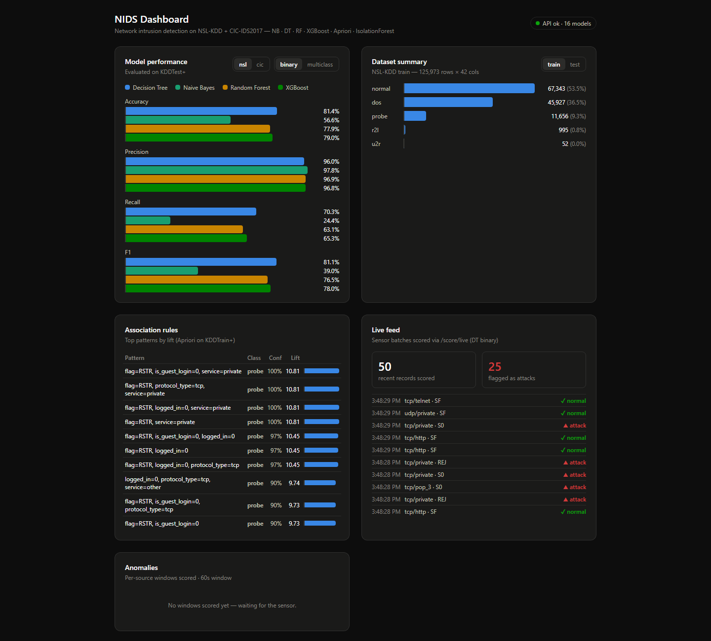

# NIDS Dashboard

A two-tier **Network Intrusion Detection System** dashboard: a Python/FastAPI machine-learning backend trained on the NSL-KDD dataset, and a Next.js 15 frontend that visualizes model performance, dataset composition, discovered attack patterns, and a real-time scored traffic feed.



```
┌─────────────┐   POST /score/live   ┌──────────────────┐   GET /metrics /rules ...   ┌──────────────┐
│   Sensor     │ ───────────────────► │  FastAPI backend  │ ◄────────────────────────── │   Next.js     │
│ (Pi / sim)   │                      │  :8000            │                             │  dashboard    │
└─────────────┘                      │  NB · DT · KMeans │                             │  :3000        │
                                     │  Apriori rules    │                             └──────────────┘
                                     └──────────────────┘
```

## Features

- **Binary + multiclass classification** — Gaussian Naive Bayes, Decision Tree, Random Forest, and XGBoost, trained on `KDDTrain+` (125,973 connections), evaluated on `KDDTest+` (22,544 connections, including attack types unseen in training)
- **Unsupervised clustering** — KMeans sweep k=2..10 with inertia + silhouette scoring
- **Association rule mining** — Apriori (mlxtend) surfaces human-readable attack signatures, e.g. `{flag=RSTR, service=private} → probe` (confidence 1.0, lift 10.8)
- **Live scoring** — a sensor client streams connection records to `/score/live`; the dashboard's Live Feed panel shows attacks flagged in near-real time
- **Modern traffic models (CIC-IDS2017)** — a second model family trained on 32 flow-metadata features (sizes, timings, TCP flags) that work on today's encrypted traffic; toggle `nsl`/`cic` in the dashboard, select with `dataset=cic` on the API, or run the Pi sensor with `--schema cic`
- **Fully reproducible** — data and model artifacts are gitignored and regenerate from two CLI commands

## Results (KDDTest+)

| Model | Binary acc / F1 | Multiclass acc / F1 (macro) |
|-------|-----------------|------------------------------|
| Decision Tree | **0.814** / 0.811 | 0.763 / 0.574 |
| XGBoost | 0.790 / 0.780 | **0.776** / 0.561 |
| Random Forest | 0.779 / 0.765 | 0.741 / 0.509 |
| Gaussian NB | 0.566 / 0.390 | 0.473 / 0.330 |

KDDTest+ deliberately contains novel attack types, so ~78–81% is in line with published single-model baselines. Notably the single Decision Tree edges out the ensembles on binary detection here — a known NSL-KDD quirk (ensembles fit the training attack distribution more tightly and generalize slightly worse to unseen attack types).

## Quickstart

**Prereqs:** Python 3.11, Node 18+

### 1. Backend (API on :8000)

```powershell
cd backend
python -m venv .venv
.venv\Scripts\activate            # (Linux/macOS: source .venv/bin/activate)
pip install -r requirements.txt

python -m nids.data download      # fetch + verify NSL-KDD -> data/raw/
python -m nids.models train       # transformer + NB/DT/KMeans -> data/processed/
python -m nids.association build  # Apriori rules -> data/processed/rules.csv

# optional: modern-traffic models (CIC-IDS2017, ~230 MB download)
python -m nids.cic download
python -m nids.models train --dataset cic

pytest                            # 41 tests, synthetic fixtures only
uvicorn main:app --reload --port 8000
```

### 2. Frontend (dashboard on :3000)

```powershell
cd frontend
npm install
npm run dev
```

Open **http://localhost:3000**.

### 3. Live feed (optional)

```powershell
cd backend
.venv\Scripts\python sensor_sim.py    # streams 5 records every 2s to /score/live
```

The simulator samples real `KDDTest+` records.

### 4. Real Pi sensor (optional)

A real packet-capture sensor lives in [`sensor/`](sensor/README.md). It sniffs live traffic (scapy), assembles flows, derives the NSL-KDD features on the fly, and POSTs to the same `/score/live` endpoint:

```bash
cd sensor
python3 -m venv .venv && .venv/bin/pip install -r requirements.txt
sudo .venv/bin/python -m nids_sensor --iface eth0 --url http://<backend-host>:8000
```

See [sensor/README.md](sensor/README.md) for capture permissions, feature-derivation notes, and limitations.

## API

| Method | Path | Params | Description |
|--------|------|--------|-------------|
| GET | `/health` | — | status + loaded models |
| POST | `/predict` | `model=nb\|dt\|rf\|xgb`, `phase=binary\|multiclass`, `dataset=nsl\|cic` | classify a batch of records |
| GET | `/metrics` | `phase=binary\|multiclass`, `dataset=nsl\|cic` | all-model held-out metrics |
| GET | `/dataset/summary` | `split=train\|test` | rows, cols, class distribution |
| GET | `/rules` | — | top 20 association rules by lift |
| POST | `/score/live` | `dataset=nsl\|cic` | batch scoring for the live sensor (DT binary) |
| GET | `/live/recent` | `limit` | rolling buffer of live-scored events |

`dataset=nsl` (default) uses the NSL-KDD 41-feature models; `dataset=cic` uses models trained on CIC-IDS2017's modern flow-metadata features (32 numeric features derived from packet sizes, timings, and TCP flags — computable on encrypted traffic).

Interactive docs: **http://localhost:8000/docs**

## Project structure

```
backend/
  nids/
    data.py            NSL-KDD download + verification + loading
    preprocessing.py   FeatureTransformer (one-hot + scaling) + label maps
    flowschema.py      modern 32-feature flow schema + CIC label maps
    cic.py             CIC-IDS2017 download + cleaning + split + scaler
    models.py          model training (NSL-KDD + CIC), KMeans sweep, persistence
    association.py     Apriori rule mining -> rules.csv
    evaluation.py      accuracy / precision / recall / F1
  tests/               pytest suite — synthetic fixtures, never the real dataset
  main.py              FastAPI app
  sensor_sim.py        simulated Pi sensor
  SPEC.md              full build spec
frontend/
  app/                 Next.js 15 (App Router)
  components/          MetricsPanel · DatasetPanel · RulesPanel · LiveFeedPanel
  lib/api.ts           typed API client
sensor/
  nids_sensor/         Raspberry Pi capture client (scapy -> flows -> features)
  tests/               pytest suite — pure-Python, no capture required
```

## Stack

**Backend:** FastAPI · scikit-learn · XGBoost · mlxtend · pandas · joblib · pytest
**Frontend:** Next.js 15 · React 19 · TypeScript · Tailwind CSS 4

## Dataset

[NSL-KDD](https://github.com/defcom17/NSL_KDD) — a curated revision of the KDD Cup '99 intrusion detection benchmark. 41 features per connection record; labels cover normal traffic plus attacks in 4 families (DoS, Probe, R2L, U2R).

## License

[MIT](LICENSE)
